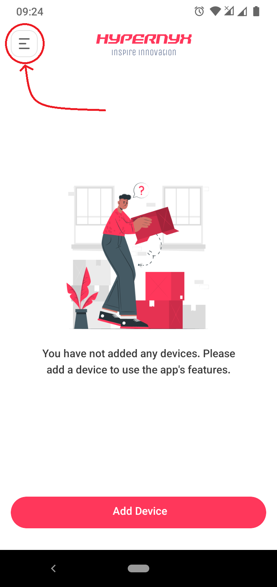
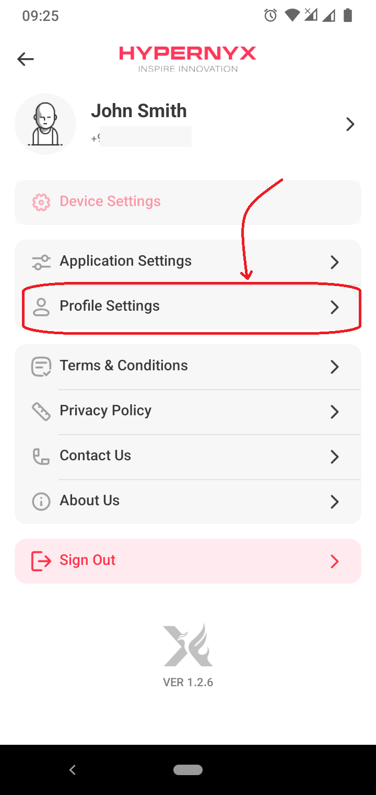
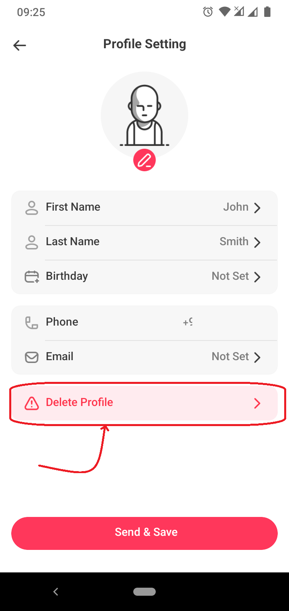
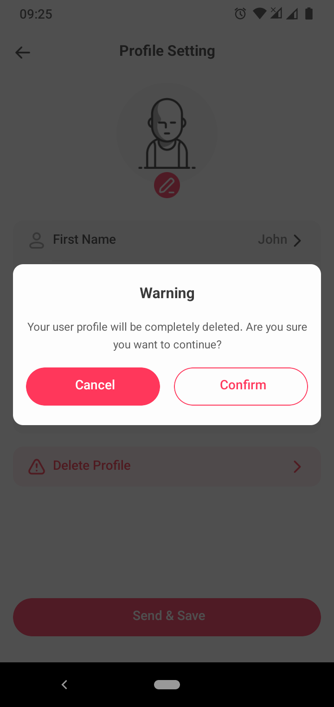

<h1 style="text-align: center;">How to Delete Your Account</h1>

If you wish to delete your profile, please follow these steps:

## Open the Side Menu

Open **Hypernyx App** and tap on the menu icon located at the top-left corner of the screen.

## Navigate to Profile Settings

In the side menu, scroll down and select **Profile Settings**.

## Delete Profile

Within the Profile Settings, find and tap on the **Delete Profile** button.

## Confirm Deletion

A confirmation pop-up will appear. Please read the information carefully and confirm your decision by tapping **Confirm**.

Note that deleting your profile will permanently remove **all your personal data**, including your:

- **name**
- **phone number**
- **email address**
- **date of birth**
- **added devices**
